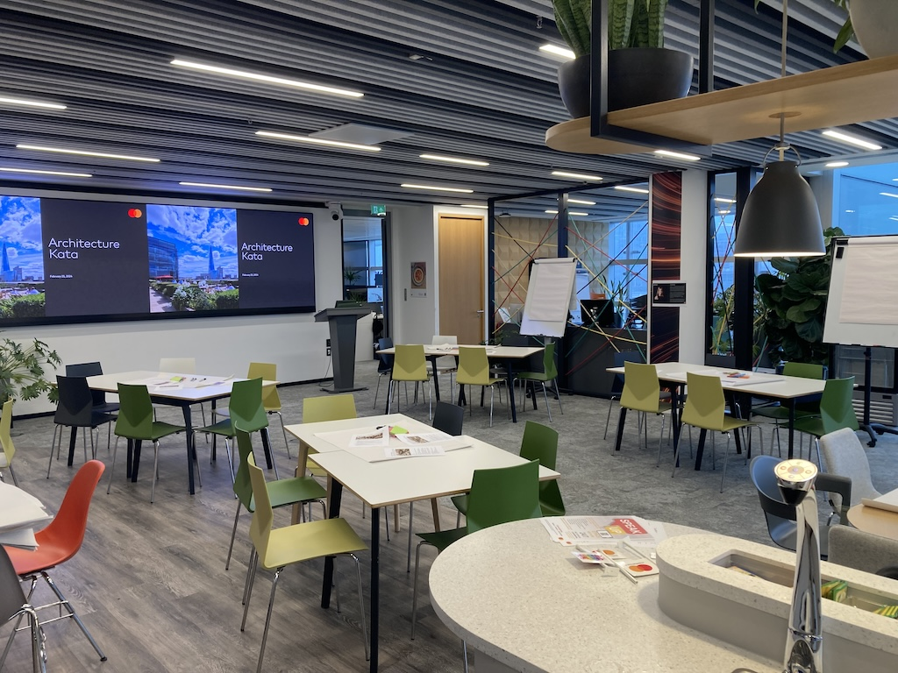
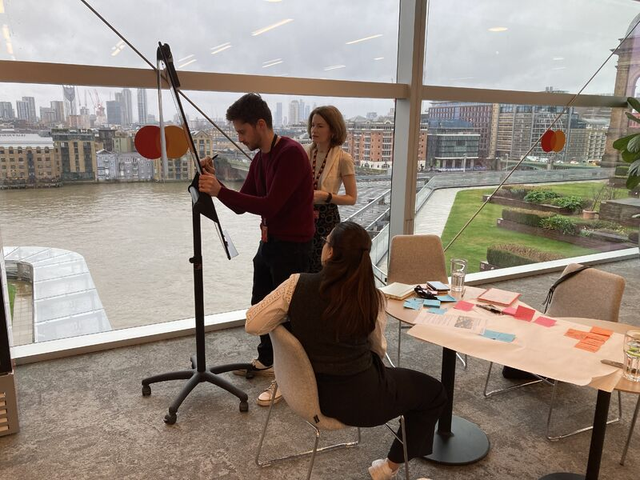

# Architecture Kata — Facilitator Playbook

## Objectives

The goal of an architecture kata is for teams to design a system in response to a Request for Proposal (RFP) from a fictitious customer. Teams then come together to present their solution to the group.

The requirements are deliberately incomplete with facilitators acting as Product Managers to clarify requirements and provide context by answering questions.

One of the main benefits of this exercise is the appreciation of different perspectives and approaches to the problem both from teammates in the design phase and from other teams in the presentation phase. This can be reinforced by an optional retrospective at the end of the session.

## Source

The Architecture Kata was initially developed by Ted Neward. This example RFP used in this exercise is based on one developed by [Matthew Belcher](https://www.linkedin.com/in/matthewbelcher/). Other Kata exercises are available at [nealford.com](https://nealford.com/katas/list.html).

## Teams

Participants form teams of ideally 3-4 people. Although teams of up to six can work this does risk decreased collaborations as one or two people tend to dominate larger teams. As each team needs to present for 5 minutes it is recommended that the maximum number of teams is five.

## Duration

The typical duration of this workshop will be 90 to 120 minutes depending on the number of teams and so the time required for presentations and whether there is a retrospective.

### Suggested Timings

* Welcome and introduction presentation (5 minutes)
* Design time (50 minutes)
* Presentations (25 minutes)
* Retrospective (10 minutes)

## Material Required

* A room with tables and chairs for teams to sit around
* A1 flip chart paper
* Post-it notes
* Sharpie markers
* Facilitators to act as Product Managers - ideally more than one when more than three teams.
* Several paper versions of the [Participant Handout](./materials/pdf/participant-handout.pdf) per team.
* A paper version of the [Product Manager Brief](./materials/pdf/product-manager-brief.pdf) for each facilitator.
* A timer, an iPad or similar is ideal.

## Running the Session

The [Introduction Presentation](./materials/pptx/introduction-presentation.pptx) provides explains the background and purpose of an Architecture Kata and how the workshop will run. It also states some important rules and finishes with asking the participants to get into teams. There is a [presentation script](./materials/pdf/presentation-script.pdf) to go with the presentation.

When the teams have been formed, give them 5-10 minutes to review and discuss the RFP. If the teams want to ask questions go over and use the Product Manager brief to answer as a Product Manager. Make sure that one of the facilitators has visits each team after 10 minutes whether they have asked questions or not. For the rest of the design session continue to be available for any team that has questions and check in with each team.

When there are 20 minutes left of the design session, remind each team that they will have 5 minutes to present there solution and to think about how best to present it. At 15, 10 and 5 minutes remaining remind the teams.

When the 50 minutes for design are up, bring the teams together and ask the first team to present. Use a timer to make sure each team get 5 minutes to present. Don't be afraid to cut an overrunning team off. After each presentation ask the other teams if they have any questions. As a facilitator, it is good to have a question in mind in case there are not any from the other teams.

At the end of the session, it is useful to have a brief, informal retrospective by asking the participates the following:

* What went well?
* What did you learn?
* What would you improve in your team's solution based on what the other teams presented?
* How could the Architecture Kata workshop as a whole be improved.

Good luck!, If you do perform a retrospective, it would be great to hear the results.
