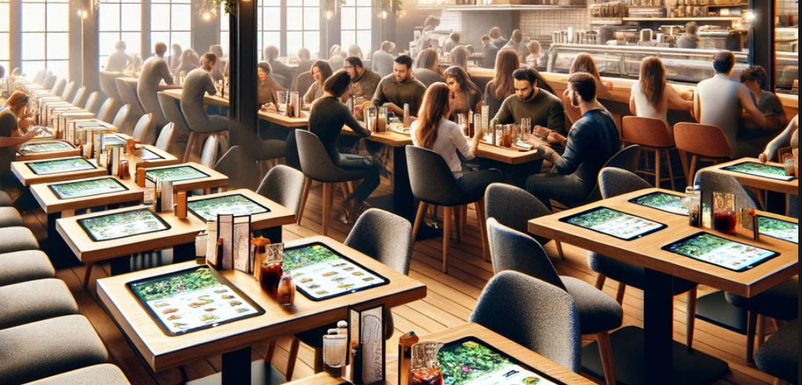

# Food At Your Fingertips

A leading restaurant chain wants to provide its customers with the ability to order food and drinks, directly from their table using a tablet provided by the restaurant, which will be embedded into the table. Orders will then be processed, and food and drinks delivered to the table by staff.

## Intended Users

* Customer
* Restaurant staff

## Requirements

* The tablet should display the complete menu of food and drinks with descriptions and images.
* Each menu item must show its price.
* Customers should be able to select and order items directly from the tablet.
* The system must enable customers to pay their bill through the tablet, with an option to email the receipt.
* Customers can summon a waiter to their table via the tablet.
A feature for customers to leave feedback about their experience should be included.
* The restaurant must have the ability to modify the menu, including adding or removing items, and updating prices, descriptions, and images.
* A management dashboard is required for restaurant staff to view key metrics related to customer orders.
* The system should allow customers to use gift vouchers as payment through the tablet.
* Customers should be able to book a future table reservation using the tablet.

## Constraints and Additional Context

* The product must be launched within 9 months, aligning with the refurbishment of the chain’s flagship restaurant.
* The customer tablets will be Android-based.
* Some of the restaurant's existing systems are hosted on Google Cloud Platform (GCP), and each restaurant has an existing private connection into GCP.
* In case a tablet malfunctions, it must be replaceable by the restaurant with another without losing any data.
